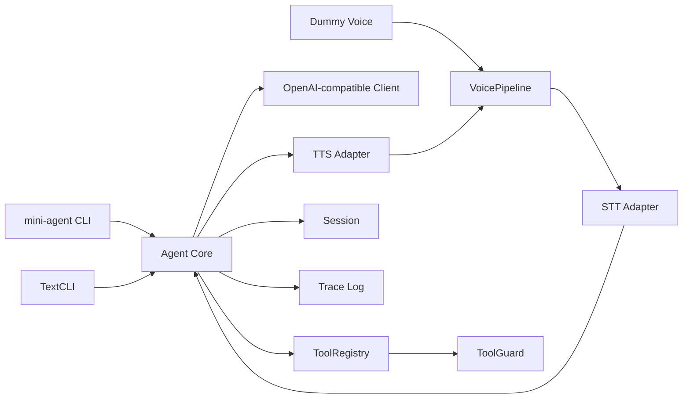

<p align="center">
  
</p>

<h1 align="center">mini-agent-core</h1>

<p align="center">
  轻量、快捷、国内 AI 友好的 Agent Core / SDK 模板
</p>

<p align="center">
  <strong>OpenAI-compatible</strong> · <strong>工具调用</strong> · <strong>Profile 配置</strong> · <strong>Dummy 语音</strong> · <strong>ARM 预留</strong>
</p>

---

## 一句话介绍

`mini-agent-core` 是一个可以快速嵌入机器人、桌面工具、Web 后台、ARM Linux 设备的轻量 Agent 核心模板：保留 Agent loop、工具系统、模型适配和语音管线，不把 LangChain 这类重框架塞进来。

它适合你把 Agent 能力接进自己的项目，而不是先搭一整套平台。

## 核心特性

| 能力 | 说明 |
| --- | --- |
| 国内 AI 友好 | 内置 Qwen、DeepSeek、Kimi、GLM、SiliconFlow、local provider preset |
| 统一模型入口 | 走 OpenAI-compatible Chat Completions |
| Profile 配置 | `config/*.yaml` 管理模型、工具、语音、MCP |
| 工具安全分层 | safe / confirm / danger 三类风险等级 |
| 统一 CLI | `mini-agent init/text/voice/tools/mcp/config` |
| 轻量语音 | 默认 dummy 语音，不要求麦克风和声卡 |
| 嵌入式友好 | 保留 ARM / C++ edge runtime 扩展方向 |

## 适合什么场景

- 想给现有 Python 项目加一个可控 Agent Core。
- 想用国内模型服务快速做文本助手、工具助手、小型机器人。
- 想在 ARM Linux、边缘设备或本地模型服务上保留扩展空间。
- 想学习一个不重、不绕、边界清楚的 Agent 模板。

## 不适合什么场景

- 需要完整多 Agent 编排平台。
- 需要开箱即用 Web UI、工作流画布、长期记忆系统。
- 需要生产级 MCP SDK 完整实现。
- 需要默认启用 shell、docker、浏览器自动化等高风险能力。

## 5 分钟快速开始

安装：

```bash
python -m venv .venv
.\.venv\Scripts\activate
python -m pip install -e ".[dev]"
```

初始化配置：

```bash
mini-agent init --profile qwen
```

填写模型名和 API Key：

```powershell
$env:DASHSCOPE_API_KEY="你的 API Key"
```

编辑 `config/models.yaml`，把 `qwen.main.model` 改成你要用的模型，例如：

```yaml
model: "qwen-plus"
```

检查配置：

```bash
mini-agent config check --profile qwen
```

启动文本模式：

```bash
mini-agent text --profile qwen
```

启动 dummy 语音模式：

```bash
mini-agent voice --profile qwen
```

更详细的新手教程见 [docs/quickstart.md](docs/quickstart.md)。

## 架构概览



## 最小代码示例

```python
from mini_agent.core.tools import ToolRegistry, tool

@tool(description="Read a sensor")
def read_sensor(name: str) -> dict:
    return {"name": name, "value": 42}

registry = ToolRegistry()
registry.register(read_sensor)
print(registry.list()[0].name)
```

## 配置文件说明

| 文件 | 用途 |
| --- | --- |
| `config/providers.yaml` | 覆盖或扩展 provider 连接信息 |
| `config/models.yaml` | 按 profile 配置 `main/stt/tts/small/embedding` |
| `config/agent.yaml` | Agent 步数、上下文、系统提示词 |
| `config/voice.yaml` | 音频设备等语音运行参数 |
| `config/tools.yaml` | 启用 safe/confirm/danger 技能 |
| `config/mcp.yaml` | MCP server profile，默认关闭 |

`config/quickstart.yaml.example` 是一文件快速配置参考；当前运行时仍使用上面的六文件高级配置。完整说明见 [docs/configuration.md](docs/configuration.md)。

## 国内模型配置示例

Qwen：

```powershell
$env:DASHSCOPE_API_KEY="你的 API Key"
mini-agent init --profile qwen
```

```yaml
# config/models.yaml
profiles:
  qwen:
    roles:
      main:
        provider: qwen
        model: "qwen-plus"
```

DeepSeek：

```powershell
$env:DEEPSEEK_API_KEY="你的 API Key"
```

```yaml
profiles:
  deepseek:
    roles:
      main:
        provider: deepseek
        model: "deepseek-chat"
```

## 本地模型配置示例

适用于 Ollama、LM Studio、llama.cpp server、vLLM：

```yaml
profiles:
  local:
    roles:
      main:
        provider: local
        model: "qwen2.5:7b"
```

```bash
mini-agent config check --profile local
mini-agent text --profile local
```

## 语音模式配置示例

默认 dummy 语音不需要麦克风：

```bash
mini-agent voice --profile local
```

真实 STT/TTS 的 adapter 和模型写在 `config/models.yaml` 的 `stt` / `tts` 角色里；音频设备写在 `config/voice.yaml`。

## 内置技能库

| 分组 | 默认状态 | 说明 |
| --- | --- | --- |
| safe | 可默认启用 | 计算、时间、格式化、摘要等只读或低风险能力 |
| confirm | 默认不启用 | 写入记忆、写文件、控制 mock LED 等需要确认 |
| danger | 默认不注册 | shell 执行等高风险能力 |

详细列表和自定义工具写法见 [docs/skills.md](docs/skills.md)。

## MCP Profile

| Profile | 用途 | 默认 |
| --- | --- | --- |
| `minimal` | 不启用 MCP | 空 |
| `online` | time、fetch、search、weather | 全部关闭 |
| `dev` | GitHub、filesystem、git、context7 | 全部关闭 |
| `danger` | playwright、shell、docker | 全部关闭 |
| `edge` | 边缘设备轻量占位 | 全部关闭 |

当前只做配置、校验、进程封装和工具桥接预留，不实现真实 MCP `tools/list` / `tools/call`。

## ARM / 嵌入式扩展建议

- Agent Core 保持 Python 轻量服务。
- 本地 LLM 走 OpenAI-compatible 网关。
- STT 可接 whisper.cpp 或 sherpa-onnx。
- TTS 可接 Piper 或 sherpa-onnx TTS。
- 硬件能力通过 HTTP、Unix Socket、串口网关、ROS2 Service 或 `edge/cpp_tool_runtime` 暴露。

## 安全说明

- 不要把真实 API Key 写入 YAML。
- `config show` 只显示环境变量是否存在，不打印真实 Key。
- MCP 默认关闭，filesystem 必须配置 sandbox。
- shell、docker、playwright 和 danger 技能默认关闭。
- 模型名由用户自己填写，模板不会替你选择生产模型。

## 开发者文档

- [快速开始](docs/quickstart.md)
- [配置指南](docs/configuration.md)
- [技能库说明](docs/skills.md)
- [Edge Runtime 占位](edge/README.md)
