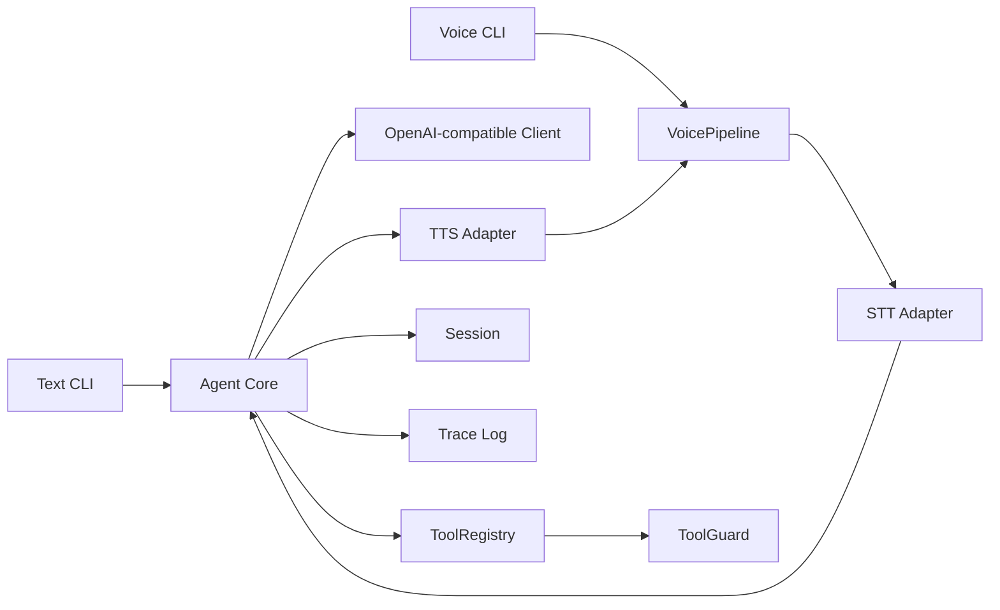

<p align="center">
  
</p>

<h1 align="center">mini-agent-core</h1>

<p align="center">
  轻量、可复用、国内 AI 友好的 Agent Kernel / SDK 模板
</p>

<p align="center">
  <strong>文本交互</strong> · <strong>语音管线</strong> · <strong>工具调用</strong> · <strong>OpenAI-compatible</strong> · <strong>ARM/嵌入式预留</strong>
</p>

---

## 项目定位

`mini-agent-core` 是一个轻量 AI Agent 模板核心架构。它不是完整业务项目，也不是大而全 Agent 平台，而是一个可以快速植入机器人、APP、ARM Linux 开发板、Web 后台、桌面工具等项目的最小 Agent Kernel。

这个项目的重点是把 Agent 的核心骨架做清楚：

- 文本模式和语音模式共用同一个 `Agent`。
- 工具调用有统一注册、JSON Schema、权限和日志。
- LLM 统一走 OpenAI-compatible Chat Completions。
- 国内 AI 服务优先适配，国外和本地模型服务保持通用兼容。
- 语音和 ARM 能力只做轻量接口，不把重型框架塞进核心。

## 架构概览



目录结构：

```text
mini_agent/
  core/          # Agent loop、LLM 边界、消息、工具、会话、权限、配置、trace
  interaction/   # text_cli、voice_cli
  voice/         # VoicePipeline 与音频/STT/TTS/VAD/wakeword 接口
  adapters/      # 国内 AI provider、OpenAI-compatible、dummy STT/TTS、MCP/本地语音预留
  builtin_tools.py
examples/
tests/
edge/
logo/
```

## 安装与测试

```bash
python -m venv .venv
.\.venv\Scripts\activate
python -m pip install -e ".[dev]"
python -m pytest
```

离线工具调用 demo：

```bash
python examples/text_tool_demo.py
```

## 国内 AI 快速开始

复制 `.env.example` 为 `.env`，优先使用 `LLM_PROVIDER` 选择厂商。如果不想记 base_url，可以只填 provider 和对应 API Key。

| Provider | 别名 | API Key 环境变量 | 默认 base_url | 默认模型 |
| --- | --- | --- | --- | --- |
| `deepseek` | `ds` | `DEEPSEEK_API_KEY` | `https://api.deepseek.com` | `deepseek-v4-flash` |
| `qwen` | `dashscope`, `aliyun`, `bailian`, `tongyi` | `DASHSCOPE_API_KEY` | `https://dashscope.aliyuncs.com/compatible-mode/v1` | `qwen-plus` |
| `kimi` | `moonshot` | `MOONSHOT_API_KEY` | `https://api.moonshot.cn/v1` | `kimi-k2.6` |
| `glm` | `zhipu`, `bigmodel`, `zai` | `ZHIPUAI_API_KEY` | `https://open.bigmodel.cn/api/paas/v4` | `glm-4.5` |
| `siliconflow` | `sf`, `guiji`, `silicon` | `SILICONFLOW_API_KEY` | `https://api.siliconflow.cn/v1` | `deepseek-ai/DeepSeek-V3.1` |
| `local` | `ollama`, `lmstudio`, `llama_cpp`, `vllm` | `LOCAL_LLM_API_KEY` | `http://localhost:11434/v1` | `qwen2.5:7b` |

查看当前内置 provider：

```bash
python examples/provider_quickstart.py
```

## `.env` 示例

DeepSeek：

```env
LLM_PROVIDER=deepseek
DEEPSEEK_API_KEY=sk-...
```

千问 / 阿里云百炼 DashScope：

```env
LLM_PROVIDER=qwen
DASHSCOPE_API_KEY=sk-...
LLM_MODEL=qwen-plus
```

Kimi / Moonshot：

```env
LLM_PROVIDER=kimi
MOONSHOT_API_KEY=sk-...
LLM_MODEL=kimi-k2.6
```

本地模型服务，例如 Ollama、LM Studio、llama.cpp server、vLLM：

```env
LLM_PROVIDER=local
LLM_BASE_URL=http://localhost:11434/v1
LLM_API_KEY=ollama
LLM_MODEL=qwen2.5:7b
```

自定义 OpenAI-compatible 服务：

```env
LLM_PROVIDER=custom
LLM_BASE_URL=https://your-compatible-endpoint/v1
LLM_API_KEY=sk-...
LLM_MODEL=your-model-name
```

如果厂商需要额外参数，可以使用：

```env
LLM_EXTRA_BODY_JSON={"top_p":0.8}
LLM_ENABLE_THINKING=false
```

显式设置 `LLM_BASE_URL` 时，会优先使用你写的地址，不再使用 provider 默认地址。

## 文本模式

通用文本 CLI：

```bash
python examples/text_chat_demo.py
```

厂商专用快捷示例：

```bash
python examples/text_deepseek_demo.py
python examples/text_qwen_demo.py
python examples/text_kimi_demo.py
```

CLI 命令：

- `/exit` 退出
- `/reset` 清空当前会话
- `/tools` 查看已注册工具

## 语音模式

默认提供 dummy STT/TTS，不需要麦克风、扬声器或语音模型：

```bash
python examples/voice_dummy_demo.py
```

语音流程：

```text
AudioInput -> VAD/manual stop -> STT -> AgentCore -> TTS -> AudioOutput
```

带真实 LLM、dummy 音频输入输出的语音管线：

```bash
python examples/voice_openai_demo.py
```

`VoicePipeline` 只负责编排，不绕开 Agent 工具系统和权限系统。

## 注册工具

```python
from mini_agent.core.tools import ToolRegistry, tool

@tool(description="Read a sensor")
def read_sensor(name: str) -> dict:
    return {"name": name, "value": 42}

registry = ToolRegistry()
registry.register(read_sensor)
```

风险等级：

- `safe`：默认，可直接执行。
- `confirm`：必须提供 `confirm_callback` 且返回 True。
- `danger`：默认禁止，除非 `ToolGuard(allow_danger=True)`。

内置 mock 工具：

- `get_time()`
- `calculate(expression: str)`
- `get_system_status()`
- `read_mock_sensor(sensor_name: str)`
- `set_mock_led(state: str)`，`risk_level=confirm`
- `dangerous_shell(command: str)`，`risk_level=danger`，默认禁用

## 在代码中选择 Provider

```python
from mini_agent.adapters.openai_compatible import OpenAICompatibleClient

llm = OpenAICompatibleClient.from_provider(
    provider="qwen",
    api_key="sk-...",
    model="qwen-plus",
    timeout=30,
)
```

也可以完全自定义：

```python
llm = OpenAICompatibleClient(
    base_url="http://localhost:11434/v1",
    api_key="ollama",
    model="qwen2.5:7b",
)
```

## ARM / 嵌入式扩展

项目核心不写死 PC 路径，模型路径、API 地址、音频设备都通过配置或环境变量传入。

推荐部署方式：

- Agent Core 作为轻量 Python 服务运行。
- 本地 STT 可接 whisper.cpp 或 sherpa-onnx。
- 本地 TTS 可接 Piper 或 sherpa-onnx TTS。
- 硬件能力由 C++ Edge Runtime、HTTP、Unix Socket、ROS2 Service、串口网关暴露给 Agent。

`edge/cpp_tool_runtime` 是低层工具运行时的占位结构。

## MCP 扩展

`mini_agent/adapters/mcp_adapter.py` 只保留边界，不强依赖 MCP Python SDK。后续可以把 MCP tool metadata 映射为本项目的 `ToolDefinition`，让 MCP 工具进入同一套权限和日志系统。

## 设计参考

- smolagents：参考极简 Agent loop 和小抽象。
- Mozilla tinyagent：参考轻依赖、callback、tracing、MCP 预留。
- OpenAI Agents SDK：参考 Agent、Tools、Guardrails、VoicePipeline 的概念边界。
- Pipecat / LiveKit Agents：参考实时语音管线思想，不作为核心依赖。
- whisper.cpp、sherpa-onnx、Piper：作为 ARM / 本地 STT/TTS 适配方向。
