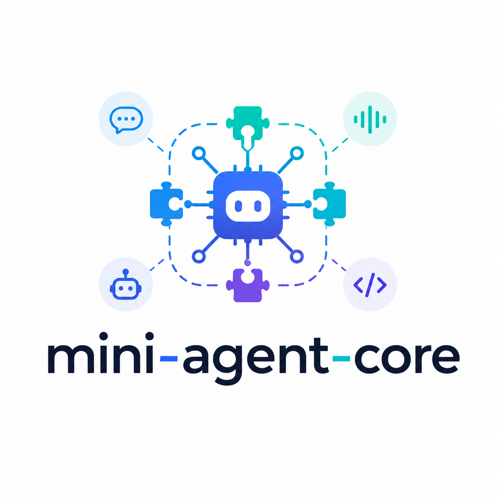

<p align="center">
  
</p>

<h1 align="center">mini-agent-core</h1>

<p align="center">
  <strong>轻量、可移植、国内 AI 友好的 Agent Core / SDK 模板</strong>
</p>

<p align="center">
  <code>OpenAI-compatible</code>
  · <code>CLI-first</code>
  · <code>ToolPack</code>
  · <code>AgentSpec</code>
  · <code>ROS2-ready</code>
</p>

<p align="center">
  初始化一次即可启动；不写死模型名，不默认启用危险工具，适合嵌入 CLI、APP、Web、机器人和 ARM 项目。
</p>

<p align="center">
  <a href="#快速开始">快速开始</a>
  · <a href="#核心能力">核心能力</a>
  · <a href="#agent-自定义">Agent 自定义</a>
  · <a href="#工具与扩展">工具扩展</a>
  · <a href="#ros2--机器人接入">ROS2 接入</a>
</p>

---

## 一句话介绍

`mini-agent-core` 是一个可以嵌入 CLI、桌面 APP、Web 后台、机器人和 ARM 设备的轻量 Agent Core。它保留模型适配、Agent loop、工具系统、状态事件和 dummy 语音，不引入 LangChain、LangGraph、CrewAI、AutoGen，也不默认启用 MCP 或 danger 工具。

它更像一个“可交付的 Agent 内核模板”，而不是一个只能跑 demo 的脚手架：你可以先用 CLI 完成模型、Agent、工具和安全边界的验证，再把同一套能力嵌入到自己的业务系统、机器人项目或边缘设备中。

## 这个项目适合什么场景

| 场景                | 你可以怎么用                                                                 |
| ------------------- | ---------------------------------------------------------------------------- |
| 快速验证 Agent 方案 | 用 CLI 跑通模型配置、Agent loop、工具调用和状态事件                          |
| 接入国内模型服务    | 使用 OpenAI-compatible 配置对接通义千问、DeepSeek、Kimi、GLM、硅基流动等服务 |
| 嵌入现有项目        | 将`mini_agent` 作为轻量 SDK，引入到 CLI、APP、Web 后台或自动化任务中       |
| 扩展项目工具        | 通过 ToolPack、Capability 和外部 extension 注入业务工具                      |
| 机器人 / ARM 项目   | 保留 Agent 上层调度能力，真实 ROS2 工具在业务项目中按需接入                  |

## 设计取向

- **轻量优先**：只保留 Agent Core 需要的模型适配、会话、工具、安全和状态事件，不绑定大型编排框架。
- **配置优先**：模型、Agent、工具、语音、MCP 都从配置进入，方便迁移和复用。
- **国内 AI 友好**：以 OpenAI-compatible 接口为核心，适配本地模型服务和国内主流模型服务。
- **安全默认值**：工具按 `safe` / `confirm` / `danger` 分级，危险能力不会默认注册。
- **可嵌入**：CLI 是验证入口，最终目标是让内核能进入你的真实项目。

## 核心能力

| 能力         | 说明                                                                  |
| ------------ | --------------------------------------------------------------------- |
| 模型配置闭环 | `models list/use/check/doctor` 帮你查询、写入、验证模型 ID          |
| 一键启动     | `use` 一次后可直接 `start/chat/speak`                             |
| Agent 可配置 | `config/agents.yaml` 描述身份、能力、边界、风格                     |
| 工具可扩展   | `ToolDefinition` metadata、`tools describe`、ToolPack、Capability |
| 默认安全     | safe/confirm/danger 分级；danger 默认不注册                           |
| 可嵌入       | ROS2/APP/Web/ARM 项目可通过外部 ToolPack 注入能力                     |

## 项目结构

```text
mini-agent-core/
├─ mini_agent/          # Agent Core、模型适配、CLI、工具系统、语音管线
├─ config/              # provider、model、agent、tool、voice、MCP 配置示例
├─ docs/                # 快速开始、配置、Agent 扩展、ROS2 接入等文档
├─ examples/            # 文本、语音、工具、provider 示例
├─ edge/                # 面向边缘设备的 C++ tool runtime 占位示例
└─ tests/               # CLI、配置、工具、安全、模型、会话等测试
```

## 快速开始

```powershell
cd mini-agent-core
python -m venv .venv
.\.venv\Scripts\activate
python -m pip install -e ".[dev]"
```

先选择 `<profile>`。远程服务 profile 需要先设置 API Key 环境变量；本地 profile 不需要 Key，但要先启动 OpenAI-compatible 服务。

```powershell
mini-agent init --profile <profile>

# 远程服务：按下方表格设置对应环境变量；本地服务可跳过这一行。
$env:<API_KEY_ENV>="你的 API Key"

# 本地服务：先启动 Ollama、LM Studio、llama.cpp server、vLLM 等 OpenAI-compatible 服务。
mini-agent models list --profile <profile>
mini-agent models use --profile <profile> --model "<从上一步复制的模型ID>"
mini-agent config check --profile <profile>
mini-agent use --profile <profile> --agent default
mini-agent start
```

常用 profile 与环境变量：

| profile         | 用途                        | API Key 环境变量        |
| --------------- | --------------------------- | ----------------------- |
| `local`       | 本地 OpenAI-compatible 服务 | 通常为空                |
| `qwen`        | 阿里云百炼 / DashScope      | `DASHSCOPE_API_KEY`   |
| `deepseek`    | DeepSeek                    | `DEEPSEEK_API_KEY`    |
| `kimi`        | Moonshot Kimi               | `MOONSHOT_API_KEY`    |
| `glm`         | 智谱 GLM                    | `ZHIPUAI_API_KEY`     |
| `siliconflow` | 硅基流动                    | `SILICONFLOW_API_KEY` |

如果你已经设置好 API Key 或本地服务，可以用向导模式：

```powershell
mini-agent init --profile <profile> --wizard
```

如果 provider 不支持 `/models`，就到服务商控制台或本地模型服务页面复制模型 ID，然后运行：

```powershell
mini-agent models use --profile <profile> --model "<模型ID>"
```

`<profile>` 可以是 `local`、`qwen`、`deepseek`、`kimi`、`glm`、`siliconflow`、`remote` 或你自己配置的 profile。README 不把任何厂商 profile 当默认选择。

## 推荐使用路径

1. 用 `mini-agent init --profile <profile>` 初始化配置。
2. 用 `models list` 查看服务端实际可用模型。
3. 用 `models use` 写入你明确选择的模型 ID。
4. 用 `config check` 检查 profile、模型和环境变量。
5. 用 `use` 固定当前 profile 与 Agent。
6. 用 `start`、`chat` 或 `speak` 进入交互。
7. 根据项目需要扩展 Agent、ToolPack、MCP 或语音管线。

## 一次配置，后续启动

```powershell
mini-agent use --profile <profile> --agent default
mini-agent status
mini-agent start   # 等价文本交互
mini-agent chat    # 等价文本交互
mini-agent speak   # dummy 语音交互
```

`.mini-agent/state.json` 只保存 `default_profile`、`default_agent`、`default_mode`、`config_dir`，不保存模型名、base_url、API Key 或示例模型。

## Agent 自定义

复制 `config/agents.yaml.example` 为 `config/agents.yaml` 后，可以配置多个 Agent：

```yaml
agents:
  default:
    name: MiniAgent
    role: 通用轻量任务助手
    identity: 你是一个可嵌入项目的轻量 Agent Core。
    capabilities: [解释配置, 调用 safe 工具, 拆解任务]
    boundaries: [不保存密钥, 不绕过 danger 限制]
```

启动时选择：

```powershell
mini-agent text --profile <profile> --agent default
mini-agent use --profile <profile> --agent ros2_robot
```

Agent 配置建议把“能做什么”和“不能做什么”同时写清楚。这样在 CLI、Web 后台、机器人项目中复用同一个 Agent 时，身份、能力和边界不会散落在业务代码里。

## 工具与扩展

查看工具：

```powershell
mini-agent tools list --profile <profile>
mini-agent tools describe web_search --profile <profile>
```

`config/tools.yaml` 支持旧写法：

```yaml
enabled: [calculator, web_search]
```

也支持 ToolPack 写法：

```yaml
toolpacks:
  enabled: [builtin.basic, builtin.web]
tools:
  enabled: [calculator, fetch_url_text_public]
extensions:
  - module: project_tools.ros2_tools
    factory: build_ros2_toolpack
```

推荐把通用工具放进内置或项目级 ToolPack，把业务工具放在外部 extension 中。这样 Agent Core 保持干净，业务项目也可以独立演进。

### 工具安全分级

| 分级        | 适合能力                                        | 默认策略               |
| ----------- | ----------------------------------------------- | ---------------------- |
| `safe`    | 计算、只读查询、公开网页读取等低风险能力        | 可直接注册             |
| `confirm` | 需要用户确认的操作，例如发送请求、触发外部动作  | 注册前后应保留确认链路 |
| `danger`  | Shell、文件破坏性操作、生产环境写入等高风险能力 | 默认不注册             |

这套分级不是为了限制扩展，而是让项目在进入真实业务系统前有清晰的安全边界。

## ROS2 / 机器人接入

项目提供 `mini_agent.toolpacks.ros2_stub` 作为占位，不默认依赖 `rclpy`。真实 ROS2 工具建议放在你的机器人项目中，通过外部 ToolPack 注入。Agent 只做上层任务协调，不负责实时控制、急停、避障或底盘闭环。

推荐接入方式：

1. 在机器人项目中实现 ROS2 ToolPack。
2. 在 `config/tools.yaml` 的 `extensions` 中注册 factory。
3. 让 Agent 只输出任务级意图，由 ROS2 节点负责实时控制和安全保护。

## 配置文件说明

| 文件                      | 作用                                       |
| ------------------------- | ------------------------------------------ |
| `config/providers.yaml` | provider、base_url、API Key 环境变量等配置 |
| `config/models.yaml`    | 当前 profile 选择的模型 ID                 |
| `config/agents.yaml`    | 多 Agent 身份、能力、边界和风格            |
| `config/tools.yaml`     | ToolPack、工具启用列表和外部扩展           |
| `config/voice.yaml`     | dummy / OpenAI / 本地语音相关配置          |
| `config/mcp.yaml`       | MCP server 配置，默认不强制启用            |

真实 API Key 应放在环境变量中，不要写入仓库。

## 文档

- [快速开始](docs/快速开始.md)
- [配置指南](docs/配置指南.md)
- [Agent与扩展](docs/Agent与扩展.md)
- [ROS2接入](docs/ROS2接入.md)
- [模型示例参考](docs/模型示例参考.md)

## 开发与验证

```powershell
python -m pip install -e ".[dev]"
pytest
```

测试覆盖配置初始化、模型选择、OpenAI-compatible provider、工具安全、CLI 入口、会话状态和语音占位管线。对外展示或二次开发前，建议至少运行一次完整测试。
